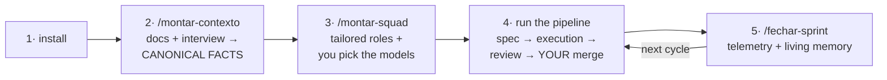

<!-- LANG-SWITCH --> **English** · [Português 🇧🇷](README.pt-BR.md)

# 🛸 SquadKit

**Assemble a squad of AI agents that molds itself to YOUR work — and that you can audit.**
Developer, content creator, analyst, manager, or organizing your personal life: same product, different roles.
Works in the AI you already use — Claude Code, Cursor, Google Antigravity, Codex, VS Code Copilot, or any chat.
Agents **reply in your language** (configurable: English, Portuguese, Spanish…).

---

## The problem

Everyone has seen an AI agent:

- 🤥 **claim "I tested it and it passed" without running anything** — and you find out in production;
- 🎲 **make up a number, a requirement, or a commitment** with total confidence;
- 🧠 **forget everything** between sessions — every chat starts from zero;
- 📄 read two documents that contradict each other and **silently pick the wrong one**;
- 🎭 ship a beautiful screen that **looks like it works but doesn't** (Potemkin UI).

Better prompts don't fix this. **Engineering does.**

## The solution

SquadKit installs a **team of AI roles** into your project (architect, devs, QA, copywriter,
analyst… or roles generated on demand) running on a **spec-driven pipeline** with
**harness engineering** — rules that don't depend on the model's goodwill:

| Pillar | What it means in practice |
|---|---|
| 📋 **Spec-driven** | Nothing is produced from a loose request: code ← spec with contracts, campaign ← brief, analysis ← structured request. Ambiguity **stops and asks** (max 5 questions, with a recommendation) — it never guesses |
| 🔒 **Harness** | "Green" only with the **real command output pasted in**; a test/checklist **is never weakened to pass** (a hook blocks it); data without a source = labeled hypothesis; **publishing/paying/merging/deploying is ALWAYS human** |
| 🧪 **Verifiable in code** | Deterministic validators, **golden evals** (does the reviewer catch a planted bug? does the dev stop at ambiguity?), telemetry and dashboard — the squad is tested the way software is tested |

And the differentiator no player on the market has (we researched it [with the code in hand](docs/PESQUISA-MERCADO-2026-07.md)):
**trust in execution**. spec-kit (GitHub), Kiro (AWS), BMAD and the like are great at spec and
traceability — but their gates are prompt instructions policed by the same LLM that produces the
work. Here the enforcement is **external** (hooks, scripts, evals).

## ⚡ Try it in 5 minutes (zero setup)

> **Prerequisites** (2 min): [git](https://git-scm.com/downloads) and PowerShell — native on
> Windows (5.1 works, no install needed); on macOS/Linux install
> [PowerShell 7 (`pwsh`)](https://learn.microsoft.com/powershell/scripting/install/installing-powershell).
> Not technical? Ask your own AI: *"install git and pwsh on my machine"* — that's its first test. 😉
>
> **Command note:** examples use `pwsh`. **On Windows without PowerShell 7, use `powershell`
> instead of `pwsh`** — the scripts run the same on the native 5.1.

```powershell
git clone https://github.com/ethierre/squadkit && pwsh -File squadkit/demo-squad.ps1
```
Installs an example squad with a validated spec, runs the deterministic gates on the spot, and hands
you the script: open your AI in the folder and say **"executar T-DEMO-1"** — watch the pre-flight,
executed evidence, explain-back and review work for real. Walkthrough in `DEMO.md`.

## 🚀 Full workflow (3 commands + operation)



### 1. Install (1 command — Windows/macOS/Linux)

```powershell
git clone https://github.com/ethierre/squadkit
pwsh -File squadkit/instalar-squad.ps1 -Projeto "MyProject" -Destino "C:\myproject" `
     -Perfil sob-medida -Ide claude,antigravity -Idioma "English"
# IDEs: claude · cursor · antigravity · codex · vscode · generico
# Profiles: sob-medida (tailored) ⭐ · enxuto (lean) · dev-completo · produto · plataforma · concepcao · growth · completo
# -Idioma: which language agents reply in (any). Or run -Interativo (guided questions).
```

The **AGENTS.md** (Linux Foundation standard, read by 28+ tools) is always installed; AI without
integration? `squad/INICIAR.md` — paste it into the chat and it works. (Command/flag names are in
Portuguese — the source language — but agents interact in the language you choose.)

**Update an existing install** (as SquadKit evolves): `git pull` in the clone and
`pwsh -File squadkit/atualizar-squad.ps1 -Destino "C:\myproject"` — syncs `_core`, scripts and
catalog (reading the `squad/.squadkit.json` manifest) without touching your context, team, or board.

### 2. `/montar-contexto` — the knowledge base (ALWAYS first)

Drop your documents into `squad/contexto/` and run it. The agent interviews you (max 8 questions),
reads everything, **hunts for contradictions between documents** and builds the **CANONICAL FACTS**
— each with evidence. This is what keeps the squad from erring: the May doc says X, the July doc
says Y, the code says Z — the squad now knows which one wins.

### 3. `/montar-squad` — the team molds to the context

The designer proposes the composition (roles from the catalog of 16 + roles **generated on demand**
— traffic manager? OCR specialist? pharmacy operations?), **you approve**, and for each role you get
**3 model suggestions** (🏆 performance · 💰 cost · ⚖️ cost-benefit, via leaderboards) —
**you choose**, including outside the list.

### 4. Run the pipeline

```
/myproject-squad US42          ← full story (PO → spec → devs in waves → review → QA)
/myproject-squad executar T-7  ← already-planned task (spec → dev → review → awaits YOUR merge)
/myproject-squad bug "..."     ← triage → express route
```

The squad **prepares and proves** (diff + executed evidence + review verdict); **you press the
button** (merge, publish, send, pay — always human). A QA bug goes back typed to the right role,
with live context.

### 5. `/fechar-sprint` — living memory

Validates board vs reality, records telemetry (review cycles, bugs — real data only), updates the
history and canonical facts, extracts lessons **with evidence**, and generates the `dashboard.html`.
The next cycle starts knowing everything this one learned.

## Who it's for

| You are… | Your squad |
|---|---|
| 👨‍💻 Software team | po, architect, dev-front/back/data, qa, devops, security ([real example: OCR/IDP](exemplos/aidc7/)) |
| 🎬 Content creator | copywriter, reviewer, media-manager, traffic manager ([examples](exemplos/youtube/)) |
| 📊 Analyst/operations | sales analyst, operations with versioned checklist ([examples](exemplos/pbm-farma/)) |
| 🏠 Personal life | schedule/routine manager — with "confirming/paying is on you" ([example](exemplos/pessoal/)) |
| 🧩 Anything else | `-Perfil sob-medida` + `/montar-squad` generates the roles from scratch, with the harness built in |

## Under the hood

```
core/            montar-contexto · montar-squad · pipeline · fechar-sprint (single source, any IDE)
                 + best-practices with whenToUse (models, spec, evidence, review, data, content)
roles/           16 ready-made roles + ROLE-TEMPLATE (meta-template with harness invariants)
adapters/        claude-code · cursor · antigravity · codex/AGENTS.md · vscode · generic
scripts/         validate-squad · validate-spec · validate-diff · dashboard · install-git-hook
evals/           golden scenarios: planted bug · ambiguous spec · sourceless data
squad/           file-based memory with a single owner: board, decisions, bugs, specs, telemetry
```

Specs with **CA-n criteria in EARS format** (CA→task→test traceability), **execution waves** by
dependency graph, complexity >7 splits before dispatch, **rein per task**
(assisted/supervised/autonomous — autonomy proportional to consequence, the Karpathy method),
**diff budget** with automatic rejection (`validar-diff.ps1`), mandatory **explain-back**
(the dev explains the diff in 5 lines), review with **blind layers** and convergence that catches
**scope creep** (`unrequested`). Git guard across 3 IDEs (detects `--no-verify`).

## 30-second glossary

**Pipeline** = the standard flow spec → execution → review → your approval · **Spec/SDD** = the
document defining WHAT to do and how to verify it (nothing ships without one) · **Harness** = rules
enforced by code, not by trust · **Canonical facts** = the list of what WINS when documents
contradict each other · **Rein** = how much autonomy each task grants the agent · **Explain-back** =
the agent explains what it did in 5 lines before you review.

## Quick FAQ

**Do I need my own API key?** No — it uses the AI/subscription you already have (Claude Code, Cursor, etc.).
**Does it work outside software?** Yes — the pipeline is the same; only the deliverable changes (a piece, a report, a plan).
**What language do agents reply in?** Whatever you choose (`-Idioma`) — internal files may be in another language.
**Can the agent publish/merge/pay on its own?** Never. Irreversible action is a human gate, by construction.
**What if my documents contradict each other?** That's exactly what `/montar-contexto` is for.

## Roadmap & research

[ROADMAP.md](ROADMAP.md) · [CHANGELOG.md](CHANGELOG.md) · [Market research with code in hand](docs/PESQUISA-MERCADO-2026-07.md)
(spec-kit, BMAD, task-master, contains-studio, OpenSquad, Paperclip cloned and analyzed; Antigravity,
Kiro, Devin, Replit et al. mapped).

---

⭐ **If this solves a problem of yours, drop a star** — and open an issue telling us which squad you built.
Validated in production on a real fintech project (Jul 2026) before becoming a product.

License: [MIT](LICENSE). Docs are bilingual (EN/PT-BR); command names are in Portuguese, the source language.
