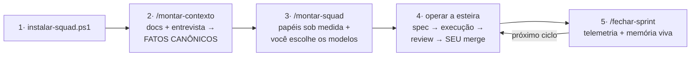

<!-- LANG-SWITCH --> [English](README.md) · **Português** 🇧🇷

# 🛸 SquadKit

**Monte um squad de agentes de IA que se molda ao SEU trabalho — e que você pode auditar.**
Dev, criador de conteúdo, analista, gestor ou organizando a vida pessoal: mesmo produto, papéis diferentes.
Funciona na IA que você já usa — Claude Code, Cursor, Google Antigravity, Codex, VS Code Copilot ou qualquer chat.
Os agentes **respondem no seu idioma** (configurável: português, inglês, espanhol…).

---

## O problema

Todo mundo já viu um agente de IA:

- 🤥 **dizer "testei e passou" sem ter rodado nada** — e você descobrir em produção;
- 🎲 **inventar um número, um requisito ou um compromisso** com toda a confiança do mundo;
- 🧠 **esquecer tudo** entre uma sessão e outra — cada chat começa do zero;
- 📄 ler dois documentos que se contradizem e **escolher o errado em silêncio**;
- 🎭 produzir uma tela linda que **parece funcionar mas não funciona** (UI Potemkin).

Prompts melhores não resolvem isso. **Engenharia resolve.**

## A solução

O SquadKit instala no seu projeto um **time de papéis de IA** (arquiteto, devs, QA, copy, analista…
ou papéis gerados sob medida) operando numa **esteira spec-driven** com **harness engineering** —
regras que não dependem da boa vontade do modelo:

| Pilar | O que significa na prática |
|---|---|
| 📋 **Spec-driven** | Nada se produz de pedido solto: código ← spec com contratos, campanha ← brief, análise ← pedido estruturado. Ambiguidade **para e pergunta** (máx. 5 perguntas, com recomendação) — nunca inventa |
| 🔒 **Harness** | "Verde" só com a **saída real do comando colada**; teste/checklist **não se enfraquece para passar** (hook bloqueia); dado sem fonte = hipótese rotulada; **publicar/pagar/mergear/deploy é SEMPRE humano** |
| 🧪 **Verificável em código** | Validadores determinísticos, **evals golden** (o reviewer pega bug plantado? o dev para diante de ambiguidade?), telemetria e dashboard — o squad é testado como se testa software |

E o diferencial que nenhum player do mercado tem (pesquisamos [com o código na mão](docs/PESQUISA-MERCADO-2026-07.md)):
**confiança na execução**. spec-kit (GitHub), Kiro (AWS), BMAD e afins são ótimos em spec e rastreabilidade —
mas os gates deles são instruções em prompt fiscalizadas pelo mesmo LLM que produz. Aqui o enforcement
é **externo** (hooks, scripts, evals).

## ⚡ Experimente em 5 minutos (sem configurar nada)

> **Pré-requisitos** (2 min): [git](https://git-scm.com/downloads) e PowerShell — nativo no
> Windows (o 5.1 já serve, não precisa instalar nada); no macOS/Linux instale o
> [PowerShell 7 (`pwsh`)](https://learn.microsoft.com/powershell/scripting/install/installing-powershell).
> Não é técnico? Peça à sua própria IA: *"instale git e pwsh na minha máquina"* — é o primeiro
> teste dela. 😉
>
> **Nota sobre o comando:** os exemplos usam `pwsh`. **No Windows sem o PowerShell 7, use
> `powershell` no lugar de `pwsh`** — os scripts rodam igual no 5.1 nativo.

> 🧭 **Dois lugares onde você digita coisas — é aqui que todo mundo se perde no início:**
> **① o terminal** (CMD / PowerShell / o terminal do VS Code) → só para INSTALAR (os comandos abaixo).
> **② dentro do chat da sua IA** (Claude Code, o painel do Claude no VS Code, Cursor…) → para OPERAR
> o squad (`executar T-DEMO-1`, `/montar-contexto`…). Instalar ≠ operar.

**Passo 1 — no terminal, instale a demo** (rode da pasta onde você quer o clone):
```powershell
git clone https://github.com/ethierre/squadkit
# Windows (PowerShell 5.1 nativo — nao precisa do PS7):
powershell -ExecutionPolicy Bypass -File squadkit\demo-squad.ps1
# macOS/Linux:
pwsh -File squadkit/demo-squad.ps1
```
Instala um squad de exemplo, roda os gates determinísticos na hora e semeia uma task pronta em
`squadkit-demo/`.

**Passo 2 — abra sua IA DENTRO da pasta da demo:**
- **Claude Code (terminal / CMD):** `cd squadkit-demo` e rode `claude`
- **Claude Code for VS Code:** File → Open Folder → `squadkit-demo`, abra o painel do Claude, inicie uma **conversa nova**
- **Cursor / Antigravity:** abra a pasta, use o chat do agente
- **Qualquer outra IA (chat web):** cole o conteúdo de `squadkit-demo/squad/INICIAR.md`

> **Claude Code:** os papéis viram subagentes só no **início** da sessão. Se você instalou com uma
> sessão do Claude já aberta, reinicie-a **uma vez** para eles carregarem. Durante a operação você
> nunca fecha/reabre — a esteira inteira roda numa conversa só.

**Passo 3 — no chat da IA, execute:**
Digite **`executar T-DEMO-1`** → veja o pré-voo, a evidência executada, o explain-back e o review
funcionando de verdade. Depois **`fechar sprint`** (gera `squad/dashboard.html`). Roteiro: `DEMO.md`.

## 🚀 Fluxo completo de uso (3 comandos + operação)



### 1. Instale (rode da pasta que contém o clone `squadkit`)

```powershell
git clone https://github.com/ethierre/squadkit

# Windows (PowerShell 5.1 nativo):
powershell -ExecutionPolicy Bypass -File squadkit\instalar-squad.ps1 -Projeto "MeuProjeto" -Destino "C:\projetos\meuprojeto" -Perfil sob-medida -Ide claude

# macOS/Linux:
pwsh -File squadkit/instalar-squad.ps1 -Projeto "MeuProjeto" -Destino ~/projetos/meuprojeto -Perfil sob-medida -Ide claude
```
> - **`-Destino` = a pasta do SEU projeto, NÃO dentro de `squadkit/`** (o instalador recusa isso).
> - Caminho mais simples: **`-Interativo`** no lugar das flags — faz 7 perguntas em linguagem clara.
> - `-Ide`: claude · cursor · antigravity · codex · vscode · generico (separe por vírgula p/ vários).
> - `-Perfil`: sob-medida ⭐ · enxuto · dev-completo · produto · plataforma · concepcao · growth · completo.
> - `-Idioma "English"`: idioma em que os agentes respondem (qualquer; padrão Português).

> **Usando VS Code?** São dois setups diferentes: **Claude Code for VS Code** (a extensão da
> Anthropic) → use `-Ide claude` (ela lê a mesma pasta `.claude/` — skills viram slash commands,
> agents viram subagents). **GitHub Copilot** → use `-Ide vscode`. Não são a mesma integração.

O **AGENTS.md** (padrão Linux Foundation, lido por 28+ ferramentas) vai sempre; sua IA sem
integração? `squad/INICIAR.md` — cole no chat e funciona.

Depois **abra sua IA dentro da pasta do projeto** (igual ao Passo 2 da demo acima:
`cd C:\meuprojeto` + `claude`, ou Open Folder no VS Code) — os passos 2–5 abaixo são todos
digitados **no chat da IA**, não no terminal.

**Atualizar uma instalação existente** (quando o SquadKit evoluir): `git pull` no clone e
`pwsh -File squadkit/atualizar-squad.ps1 -Destino "C:\meuprojeto"` — sincroniza `_core`, scripts e
catálogo (lendo o manifesto `squad/.squadkit.json`) sem tocar no seu contexto, equipe ou board.

### 2. `/montar-contexto` — a base de conhecimento (SEMPRE primeiro)

Jogue seus documentos em `squad/contexto/` e rode (no chat da IA). O agente entrevista você (máx. 8 perguntas),
lê tudo, **caça contradições entre os documentos** e monta os **FATOS CANÔNICOS** — cada um com
evidência. É o que faz o squad não errar: doc de maio diz X, doc de julho diz Y, o código diz Z —
o squad passa a saber qual vale.

### 3. `/montar-squad` — o time se molda ao contexto

O designer propõe a composição (papéis do catálogo de 16 + papéis **gerados sob medida** — gestor
de tráfego? especialista OCR? operações de farmácia?), **você aprova** e, para cada papel, recebe
**3 sugestões de modelo** (🏆 desempenho · 💰 custo · ⚖️ custo-benefício, via leaderboards) —
**você escolhe**, inclusive fora da lista.

### 4. Opere a esteira

```
/meuprojeto-squad US42          ← história completa (PO → spec → devs em ondas → review → QA)
/meuprojeto-squad executar T-7  ← task já planejada (spec → dev → review → aguarda SEU merge)
/meuprojeto-squad bug "..."     ← triagem → rota expressa
```

O squad **prepara e prova** (diff + evidência executada + veredito de review); **você aperta o
botão** (merge, publicar, enviar, pagar — sempre humano). Bug do QA volta tipado para o papel
certo, com contexto vivo.

### 5. `/fechar-sprint` — memória viva

Valida board vs realidade, registra telemetria (ciclos de review, bugs — só dado real), atualiza
o histórico e os fatos canônicos, extrai lições **com evidência** e gera o `dashboard.html`.
O próximo ciclo começa sabendo tudo que este aprendeu.

## Para quem é

| Você é… | Seu squad |
|---|---|
| 👨‍💻 Time de software | po, arquiteto, dev-front/back/dados, qa, devops, seguranca ([exemplo real: OCR/IDP](exemplos/aidc7/)) |
| 🎬 Criador de conteúdo | copy, revisor, media-manager, gestor de tráfego ([exemplos](exemplos/youtube/)) |
| 📊 Analista/operações | analista de vendas, operações com checklist versionado ([exemplos](exemplos/pbm-farma/)) |
| 🏠 Vida pessoal | gestor de agenda/rotinas — com "confirmar/pagar é você quem faz" ([exemplo](exemplos/pessoal/)) |
| 🧩 Qualquer outro | `-Perfil sob-medida` + `/montar-squad` gera os papéis do zero, com o harness embutido |

## Por dentro

```
core/            montar-contexto · montar-squad · esteira · fechar-sprint (fonte única, qualquer IDE)
                 + best-practices com whenToUse (modelos, spec, evidência, revisão, dados, conteúdo)
roles/           16 papéis prontos + ROLE-TEMPLATE (meta-template com invariantes de harness)
adapters/        claude-code · cursor · antigravity · codex/AGENTS.md · vscode · genérico
scripts/         validar-squad · validar-spec · validar-diff · dashboard · instalar-hook-git
evals/           cenários golden: bug plantado · spec ambígua · dado sem fonte
squad/           memória em ARQUIVOS com dono único: board, decisões, bugs, specs, telemetria
```

Specs com critérios **CA-n em formato EARS** (rastreabilidade CA→task→teste), **ondas de execução**
por grafo de dependências, complexidade >7 fatia antes de despachar, **rédea por task**
(assistida/supervisionada/autônoma — autonomia proporcional à consequência, método Karpathy),
**orçamento de diff** com reprova automática (`validar-diff.ps1`), **explain-back** obrigatório
(o dev explica o diff em 5 linhas), review com **camadas cegas** e convergência que pega
**scope creep** (`não-pedido`). Guarda de git em 3 IDEs (detector de `--no-verify`).

## Glossário de 30 segundos

**Esteira** = o fluxo padrão spec → execução → review → sua aprovação · **Spec/SDD** = o documento
que define O QUE fazer e como verificar (nada se produz sem um) · **Harness** = as regras impostas
por código, não por confiança · **Fatos canônicos** = a lista do que VALE quando documentos se
contradizem · **Rédea** = quanta autonomia cada tarefa dá ao agente · **Explain-back** = o agente
explica o que fez em 5 linhas antes de você revisar.

## FAQ rápido

**Precisa de API key própria?** Não — usa a IA/assinatura que você já tem (Claude Code, Cursor, etc.).
**Funciona fora de software?** Sim — a esteira é a mesma; muda o entregável (peça, relatório, plano).
**Em que idioma os agentes respondem?** No que você escolher (`-Idioma`) — os arquivos internos podem estar em outro idioma.
**O agente pode publicar/mergear/pagar sozinho?** Nunca. Ação irreversível é gate humano, por construção.
**E se meus documentos se contradizem?** É exatamente para isso que existe o `/montar-contexto`.

## Roadmap & pesquisa

[ROADMAP.md](ROADMAP.md) · [CHANGELOG.md](CHANGELOG.md) · [Pesquisa de mercado com código na mão](docs/PESQUISA-MERCADO-2026-07.md)
(spec-kit, BMAD, task-master, contains-studio, OpenSquad, Paperclip clonados e analisados; Antigravity, Kiro,
Devin, Replit e cia. mapeados).

---

⭐ **Se isso resolve um problema seu, deixa a estrela** — e abre uma issue contando qual squad você montou.
Validado em produção num projeto fintech real (jul/2026) antes de virar produto.

Licença: [MIT](LICENSE).
